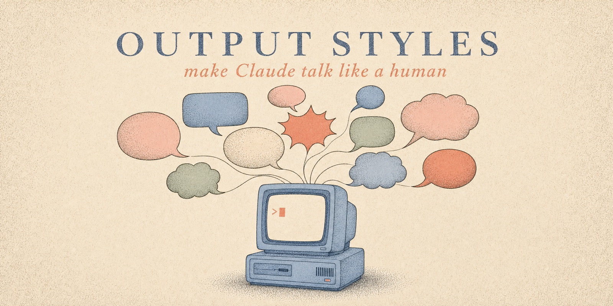
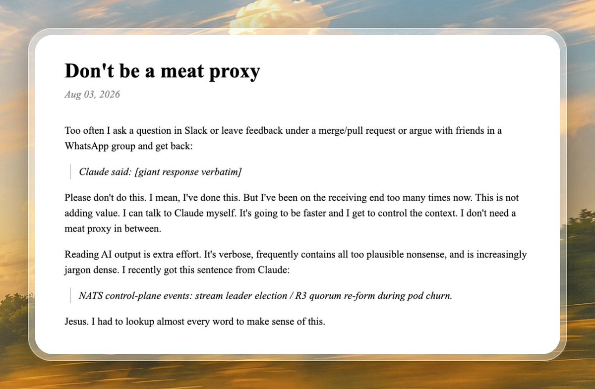

<p align="center">
  
</p>

<h1 align="center">awesome-claude-output-styles</h1>

<p align="center">
  <strong>same brain. seventeen mouths.</strong>
</p>

<p align="center">
  Make Claude talk like a human. <strong>17 installable output styles</strong> for Claude Code,<br>
  each distilled from a <strong>credited author's methodology</strong> — from Boeing-manual English<br>
  to the Minto Pyramid to bedtime stories. One curl to install and switch.
</p>

<p align="center">
  <a href="https://github.com/smixs/awesome-claude-output-styles/stargazers"></a>
  <a href="#the-styles"></a>
  <a href="https://github.com/smixs/awesome-claude-output-styles/commits/main"></a>
  <a href="LICENSE"></a>
</p>

<p align="center">
  <a href="#before--after">See it</a> ·
  <a href="#install">Install</a> ·
  <a href="#the-styles">The styles</a> ·
  <a href="#make-your-own-style-maker">Make your own</a> ·
  <a href="#shared-design-rules">Design rules</a> ·
  <a href="#the-wider-catalog">Catalog</a>
</p>

---

Output styles are the right layer for fixing Claude's voice: they modify the
system prompt itself, and Claude Code keeps reminding the model to follow them
— unlike CLAUDE.md rules, which are injected once and decay over a long
session. Every style here is one markdown file with correct 2026 frontmatter,
MIT-licensed, with the original author credited in the table below.

## Why

<p align="center">
  <a href="https://gruhn.me/blog/2026-08-03/">
    
  </a>
</p>
<p align="center"><sub>Niklas Gruhn, <a href="https://gruhn.me/blog/2026-08-03/">"Don't be a meat proxy"</a> · as shared by <a href="https://x.com/joshtriedcoding/status/2084571316263256150">Josh (@joshtriedcoding)</a></sub></p>

> Jesus. I had to lookup almost every word to make sense of this.

He's not alone — the August 2026 complaint threads run hundreds of upvotes,
and the word "Claudisms" now has [its own field guide](docs/claudisms-2026.md).
The model is brilliant; the register is exhausting. Pick a voice below and fix
it in one command.

## Before / after

Real, unedited Opus 5 output from the July 2026 threads — and the same content
through two styles from this repo:

<table>
<tr><th width="50%">🤖 Opus 5, default voice</th><th width="50%">🙂 with an output style</th></tr>
<tr><td valign="top">

> Coverage-aware cost projection: ledger-derived cost figures with exact,
> lower-bound, and unavailable states

</td><td valign="top">

**`plain-english`:**

> Do not show incomplete cost totals as exact. Say "at least $X" or "unknown".

</td></tr>
<tr><td valign="top">

> The reason your React component is re-rendering is likely because you're
> creating a new object reference on each render cycle, which breaks React's
> referential equality check, so you may want to consider memoization…

</td><td valign="top">

**`caveman`:**

> New object ref each render. Inline object prop = new ref = re-render. Wrap
> in `useMemo`. Done.

</td></tr>
</table>

```
┌──────────────────────────────────────────────────┐
│  styles                          17              │
│  credited authors & standards    20+             │
│  code touched by any persona     never           │
│  jargon left unexplained         0, by spec      │
└──────────────────────────────────────────────────┘
```

## Install

One style (installs **and** activates it):

```bash
curl -fsSL https://raw.githubusercontent.com/smixs/awesome-claude-output-styles/main/install.sh | bash -s -- eli15
```

Everything (installs all 17 + the style-maker skill; activate later via `/config`):

```bash
curl -fsSL https://raw.githubusercontent.com/smixs/awesome-claude-output-styles/main/install.sh | bash -s -- --all
```

> [!TIP]
> A style takes effect after restarting Claude Code or `/clear`. Switch or
> turn off anytime: `/config` → **Output style**. The old `/output-style`
> command was removed in v2.1.91 — most guides online are outdated.

## The styles

### Understand — for explaining to humans

| Style | What it does | Method · author |
|---|---|---|
| [`plain-english`](output-styles/plain-english.md) | ≤20-word sentences, one word one meaning, active voice | [ASD-STE100](https://www.asd-ste100.org/) (aerospace, 1983) · [Amin Boulegroun](https://github.com/AminBlg/SimpleEnglish) · [Matt Pocock](https://github.com/mattpocock/skills) ([@mattpocockuk](https://x.com/mattpocockuk)) |
| [`eli15`](output-styles/eli15.md) | Smart-teenager explanations: one analogy, its breaking point, a line to remember | ELI5 prompt research · r/explainlikeimfive house rules |
| [`analogy-engine`](output-styles/analogy-engine.md) | One sustained analogy with part-by-part mapping | IEEE ProComm · Reijnierse et al. (JCOM 2025) · CMU metaphor checklist |
| [`feynman`](output-styles/feynman.md) | Teaches, names the hard part, checks understanding with questions | Richard Feynman's technique |
| [`thing-explainer`](output-styles/thing-explainer.md) | Only the ten hundred most common words | [Randall Munroe](https://xkcd.com/1133/) (xkcd, *Thing Explainer*) |
| [`ladder`](output-styles/ladder.md) | Every answer at 3 levels: like I'm 5 → 15 → pro | the classic r/PromptEngineering pattern |

### Business — for decision-makers

| Style | What it does | Method · author |
|---|---|---|
| [`executive`](output-styles/executive.md) | Answer first, ≤3 reasons, evidence on request | Barbara Minto's [Pyramid Principle](https://www.barbaraminto.com/) · BLUF · [Sruthi Reddy](https://github.com/sruthir28/enterprise-ai-skills) · [Joe Cotellese](https://joecotellese.com) ([@jcotellese](https://x.com/jcotellese)) |
| [`smart-brevity`](output-styles/smart-brevity.md) | 6-word tease, "Why it matters:", "Go deeper:" | Smart Brevity · Jim VandeHei, Mike Allen, Roy Schwartz (Axios) |
| [`coach`](output-styles/coach.md) | One note, one image, one next action | Hemingway App rules · Paul Graham's ["Write Like You Talk"](https://paulgraham.com/talk.html) · [Hardik Pandya](https://github.com/hardikpandya/stop-slop) ([@hvpandya](https://x.com/hvpandya)) |

### Terse — for speed

| Style | What it does | Method · author |
|---|---|---|
| [`caveman`](output-styles/caveman.md) | Ultra-compact: same signal, all fluff dropped | [Julius Brussee](https://github.com/JuliusBrussee/caveman) ([@julius_brussee](https://x.com/julius_brussee)) · [Carlos Duplar Mello](https://github.com/carlosduplar/caveman-output-style-claude-code) |
| [`adhd`](output-styles/adhd.md) | Action first, numbered steps, lists ≤5, visible progress | [Ayoub Ghriss](https://github.com/ayghri/i-have-adhd) · Ramsay & Rostain (*The Adult ADHD Tool Kit*) |
| [`no-slop`](output-styles/no-slop.md) | A plain, specific human voice — the anti-Claudism style | [Siqi Chen](https://github.com/blader/humanizer) ([@blader](https://x.com/blader)) · [Conor Bronsdon](https://github.com/conorbronsdon/avoid-ai-writing) ([@ConorBronsdon](https://x.com/ConorBronsdon)) · Joe Cotellese's generic-sentence test |

### Fun — personas that still get it right

| Style | What it does | Method · author |
|---|---|---|
| [`street`](output-styles/street.md) | Sharp senior engineer in modern street slang. **18+**, profanity | house style, sibling of [pohuy](https://github.com/smixs/pohuy) |
| [`gen-z`](output-styles/gen-z.md) | Brainrot wrapper, exact engineering inside. Slang dated by design | [Anirudh Konidala](https://github.com/kidskoding/gen-z-claude-bro) · [Steve Nims](https://github.com/sjnims/gen-alpha-output-style) |
| [`sportscaster`](output-styles/sportscaster.md) | Live play-by-play on your codebase | STAA Play-by-Play Pyramid · broadcasters' craft rules |
| [`yoda`](output-styles/yoda.md) | Plain answer first; the closing lesson, inverted it is | house style |
| [`bedtime-story`](output-styles/bedtime-story.md) | Concepts as tiny calming stories, real mechanism inside | house style |

## Make your own: style-maker

Presets not fitting? Install the interview skill:

```bash
curl -fsSL https://raw.githubusercontent.com/smixs/awesome-claude-output-styles/main/install.sh | bash -s -- style-maker
```

Then tell Claude **"make my output style"**. It asks ~10 questions (audience,
length, jargon level, tone, samples of writing you like and hate), generates
a personal style file following this repo's conventions — countable specs,
positive framing, safety guardrails — shows you a live demo, and activates it.

## Shared design rules

Every style in this hub follows the same conventions
(full authoring guide: [docs/format-guide.md](docs/format-guide.md)):

- **Specs, not adjectives.** "No sentence over 20 words" is checkable;
  "be clear" is not.
- **Positive framing.** Styles describe the voice they want. Ban lists summon
  the banned patterns — so the [Claudism list](docs/claudisms-2026.md) lives
  in docs for humans, not inside prompts.
- **Byte-exact guardrails.** Code, commands, error messages, file paths, and
  numbers are never stylized. Every persona shuts off for security warnings,
  destructive-action confirmations, and order-critical instructions.
- **Cut ceremony, not reasoning.** Styles shrink the wrapper, never the
  "why".
- `keep-coding-instructions: true` everywhere — the engineering stays intact.

## The wider catalog

Original-author projects worth knowing, beyond what's adapted here:

- [mattpocock/skills](https://github.com/mattpocock/skills) — Matt Pocock
  ([@mattpocockuk](https://x.com/mattpocockuk)): `wait-what`, the four-line
  re-pitch panic button, and `writing-for-agents`, the best methodology for
  writing agent-consumed docs. Install from his repo.
- [JuliusBrussee/caveman](https://github.com/JuliusBrussee/caveman) — Julius
  Brussee ([@julius_brussee](https://x.com/julius_brussee)): the original,
  with six intensity levels, 30+ agent integrations and real benchmarks.
- [ayghri/i-have-adhd](https://github.com/ayghri/i-have-adhd) — Ayoub Ghriss:
  the top community answer to Opus 5 verbosity.
- [AminBlg/SimpleEnglish](https://github.com/AminBlg/SimpleEnglish) — Amin
  Boulegroun: ASD-STE100 enforcement with a deterministic linter.
- [blader/humanizer](https://github.com/blader/humanizer) — Siqi Chen
  ([@blader](https://x.com/blader)): the definitive AI-writing-pattern
  remover (33 patterns, self-audit loop).
- [petergyang/no-ai-slop](https://github.com/petergyang/no-ai-slop) — Peter
  Yang ([@petergyang](https://x.com/petergyang)): 20+ slop patterns with a
  voice-preservation-first stance and a self-check eval the skill runs on its
  own output.
- [hardikpandya/stop-slop](https://github.com/hardikpandya/stop-slop) —
  Hardik Pandya ([@hvpandya](https://x.com/hvpandya)): 8 rules plus a
  50-point scoring rubric.
- [conorbronsdon/avoid-ai-writing](https://github.com/conorbronsdon/avoid-ai-writing)
  — Conor Bronsdon ([@ConorBronsdon](https://x.com/ConorBronsdon)): the most
  rigorous pattern catalog (61 categories, severity tiers).
- [nattergabriel/claude-code-output-styles](https://github.com/nattergabriel/claude-code-output-styles) —
  13 well-crafted styles (Socratic, Roast, Ship It…).
- [hesreallyhim/awesome-claude-code](https://github.com/hesreallyhim/awesome-claude-code) —
  the canonical Claude Code index, with an Output Styles category.

## Sister project

[**pohuy**](https://github.com/smixs/pohuy) — the Russian profanity output
style that started this collection. Same guardrails, four roots, 18+.

## Star this repo

If one of these voices saved you a re-read, a star helps the next person find
it — and helps the credited authors get found too. ⭐

## Contributing

PRs welcome. One style per PR, following
[docs/format-guide.md](docs/format-guide.md): named methodology with credits,
countable specs, positive framing, the shared guardrails block, one
before/after example, a verify clause. If you're the original author of a
methodology we adapted and want changes — open an issue, you outrank us.

## License

[MIT](LICENSE). Adapted styles preserve their sources' copyright notices; see
credit lines in each style file.

---

<sub>
<strong>Docs:</strong> <a href="docs/format-guide.md">Format guide</a> · <a href="docs/claudisms-2026.md">Claudisms field guide</a> · <a href="skills/style-maker/SKILL.md">style-maker</a> · <a href="https://github.com/smixs/awesome-claude-output-styles/issues">Issues</a>
<br>
<strong>Also by smixs:</strong> <a href="https://github.com/smixs/pohuy">pohuy</a> — Russian profanity output style · <a href="https://github.com/smixs/visual-skills">visual-skills</a> — image prompting skills
<br><br>
MIT — the voices are free; the credit stays with their authors.
</sub>
