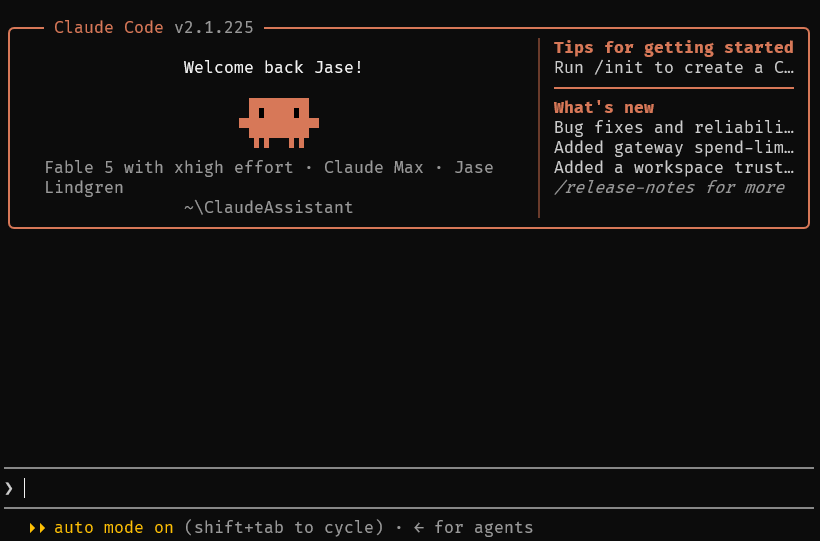

# Claude Output Style Library

[](https://github.com/jase-perf/claude-output-style-library/actions/workflows/ci.yml)
[](LICENSE)

**Claude Code has one register, and it reaches for the same shape whatever you
ask: bold lead, bulleted middle, bold recap. These eight files let you pick a
different one — and change nothing else about how Claude works.**

An output style is a Claude Code feature: a markdown file that replaces part of
the system prompt, so a voice instruction lands in the same slot as Claude's own
built-in styles instead of competing for attention in your context window. That
is why it holds when a "be concise" line in CLAUDE.md stops working. Each of the
eight here is built on a published writing method — the Minto Pyramid,
ASD-STE100 controlled English, the Feynman technique — and credited to whoever
wrote it down.

[The styles](#the-styles) · [Install](#install) ·
[Why this works](#why-this-works-when-a-claudemd-rule-doesnt) ·
[How it's built](#how-this-library-is-built)

---

## See the difference

One question, asked once per style, through Claude Code itself with that style
active. These are real answers, not illustrations — the
[full unedited transcripts](docs/examples.md) record the command, the version,
and the two places a style needed a second run.

> **Should I use a UUID or an auto-increment integer for a primary key?**

<table>
<tr><th width="26%" align="left">Style</th><th align="left">What came back</th></tr>

<tr><td valign="top">

**no style**<br><sub>Claude Code's default, for comparison. 314 words.</sub>

</td><td valign="top">

> For most applications, use an auto-increment integer (a `bigint` identity
> column) as the primary key, and only reach for UUIDs when you have a specific
> reason. Here's the reasoning.
>
> Auto-increment integers are smaller (8 bytes vs 16), faster to join and index,
> and inserts append to the end of the index rather than scattering across it…
>
> UUIDs earn their cost in a few situations:
>
> - **Keys must be generated before hitting the database** — offline clients,
>   distributed services, or batch imports…
> - **Merging data across databases or shards**, where sequential IDs from
>   different sources would collide.

</td></tr>

<tr><td valign="top">

**[`plain-prose`](output-styles/plain-prose.md)**<br><sub>Ordinary paragraphs. No template, no word budget, and claims you can check.</sub>

</td><td valign="top">

> Default to a bigint auto-increment, and reach for a UUID only when you need
> one of the three things it buys you.
>
> The integer wins on storage and index behavior. It's 8 bytes against a UUID's
> 16, and every foreign key and secondary index repeats the primary key, so the
> size difference multiplies across the schema. More importantly, sequential
> values append to the right edge of the B-tree, while random UUIDv4s land on
> random pages…

</td></tr>

<tr><td valign="top">

**[`short-answers`](output-styles/short-answers.md)**<br><sub>A ceiling you can predict before asking, closing on what it did not check.</sub>

</td><td valign="top">

> Default to a `BIGINT` auto-increment: it's half the size of a UUID, keeps
> B-tree inserts append-only, and makes debugging easier. Choose a UUID when
> clients must generate IDs offline, when rows merge across databases or shards,
> or when the ID appears in URLs and you don't want to leak row counts…
>
> Not checked: your database and whether IDs are ever exposed externally — that
> decides the tradeoff.

</td></tr>

<tr><td valign="top">

**[`decision-brief`](output-styles/decision-brief.md)**<br><sub>The answer first, the reasons that carry it underneath, the decision named.</sub>

</td><td valign="top">

> **Default to a `bigint` auto-increment key, and switch to UUIDv7 only when a
> specific need forces it** — distributed ID generation, publicly exposed IDs,
> or merging data across databases.
>
> 1. **Write and index performance favors integers.** Random UUIDs (v4) scatter
>    inserts across the B-tree, fragmenting the primary index and blowing out
>    cache…
> 2. **Size compounds everywhere.** A UUID is 16 bytes versus 8 for a bigint,
>    and the primary key is duplicated into every secondary index…

</td></tr>

<tr><td valign="top">

**[`where-we-are`](output-styles/where-we-are.md)**<br><sub>The next action on line one, for work that runs long.<br><em>Asked a different question — see below.</em></sub>

</td><td valign="top">

> Pause the backfill — or throttle it hard — before anything else. It's
> reversible, takes effect immediately, and it's also your diagnostic: what
> happens to insert latency in the next few minutes tells you which of the two
> likely causes you have.

</td></tr>

<tr><td valign="top">

**[`one-fact-per-sentence`](output-styles/one-fact-per-sentence.md)**<br><sub>One fact a sentence, under 20 words, understood on the first read.</sub>

</td><td valign="top">

> A UUID is a 128-bit identifier, usually random. An auto-increment integer is a
> number that the database creates in sequence.
>
> - The database creates each key. Your code does nothing.
> - An integer key uses 8 bytes (as `bigint`). A UUID key uses 16 bytes.
> - New integer keys are sequential. Sequential keys keep index writes fast and
>   compact.

</td></tr>

<tr><td valign="top">

**[`small-words`](output-styles/small-words.md)**<br><sub>Everyday words only, so each part is named by what it does.</sub>

</td><td valign="top">

> …use a number that grows by one each time. […] Each new row lands at the end
> of the fast look-up list the store keeps *(hard word: index — a sorted list
> that helps find rows fast)*. Landing at the end is the fast case, so writes
> stay quick and the list stays lean.

</td></tr>

<tr><td valign="top">

**[`one-analogy`](output-styles/one-analogy.md)**<br><sub>One comparison, sustained, plus the point where it stops being true.</sub>

</td><td valign="top">

> Think of the table's primary-key index as a library's shelves, and each row as
> a book being shelved. **Auto-increment integer** is shelving by arrival
> number: every new book goes at the end of the last shelf…
>
> Where the analogy breaks: in a library, a badly placed book is merely slow to
> find later. In a database, random inserts hurt *at write time*.

</td></tr>

<tr><td valign="top">

**[`your-turn`](output-styles/your-turn.md)**<br><sub>Teaches one idea, names the part people trip on, then stops and waits.</sub>

</td><td valign="top">

> The counterintuitive bit: UUIDs' insert cost has almost nothing to do with
> them being bigger than integers — it's that *randomness* destroys the "always
> insert at the right edge" pattern the B-tree is fast at.
>
> Quick check: […] which key would you pick, and what's the one future change
> that should make you reconsider? Say "just tell me" and I'll answer it
> outright.

</td></tr>
</table>

All nine reached the same recommendation — bigint by default, UUIDv7 when the ID
has to be minted elsewhere or shown to strangers. **That is the point.** A style
does not make Claude smarter or more correct; the default answer above is a
perfectly good answer. What changes is the shape it arrives in, and whether that
shape is one you chose: 102 words with the gap named, or paragraphs with no
bullets at all, or an analogy that tells you where it stops being true.
`your-turn` alone withholds the conclusion, on purpose.

Two things that table is honest about. `where-we-are` was asked about a
migration already in flight, because its rules describe a session already
underway and a one-shot question gives it no state to restate. And
`one-analogy` and `one-fact-per-sentence` each reverted to the default register
on their first run and held on the second — style adherence is strong, not
deterministic, which is also the case for the optional
[`--enforce`](#make-it-stick---enforce) hook.

## Why this works when a CLAUDE.md rule doesn't

If you have put "be concise, skip the preamble" in your CLAUDE.md and watched it
hold for a few turns and then quietly stop mattering, rewording it will not help.
The instruction is on the wrong layer.

**CLAUDE.md is context.** It arrives alongside your files, your last twenty
messages, and every tool result, all competing for the model's attention — and
the competition gets worse as the session fills up.

**An output style is the system prompt.** Claude Code injects it verbatim into
the same slot that holds its own built-in styles — Explanatory, Learning,
Proactive — so it reframes who the agent is rather than adding one more request
to a crowded window.

Your CLAUDE.md keeps working. A style sets voice; CLAUDE.md keeps carrying your
project rules, conventions, and commands. If your CLAUDE.md already has tone
instructions, you can delete those lines — otherwise Claude is being told the
same thing twice, from two places.

### What a style will not change

A style changes prose and nothing else. Every one here sets
`keep-coding-instructions: true`, so Claude Code's software-engineering
instructions stay intact, and every one carries an explicit clause: it changes
how an answer is written, never which tools run, which edits are made, or when
Claude stops to ask you something.

Code, commands, error messages, file paths, identifiers, and numbers are
reproduced byte-for-byte, never stylized. For security warnings,
destructive-action confirmations, and order-critical instructions, the styles
drop their register and switch to full, plain sentences. The one exception is
deliberate: `one-fact-per-sentence` stays on, because controlled aerospace
English is already the clearest thing to read in exactly those moments.

CI fails the build if any style stops carrying that guardrails block.

## The styles

**If you install one, install `plain-prose`.** It fixes the default register
without imposing a format, which makes it the one style that is safe to leave on
permanently.

What each one does is shown above, in its own words. Grouped here by the job
you'd reach for it on, with the method behind it:

### Everyday answers

| Style | Method · author |
|---|---|
| [`plain-prose`](output-styles/plain-prose.md) | [Siqi Chen](https://github.com/blader/humanizer) · [Peter Yang](https://github.com/petergyang/no-ai-slop) · [Conor Bronsdon](https://github.com/conorbronsdon/avoid-ai-writing) · [Hardik Pandya](https://github.com/hardikpandya/stop-slop) · Joe Cotellese |
| [`short-answers`](output-styles/short-answers.md) | [Julius Brussee](https://github.com/JuliusBrussee/caveman) · [Carlos Duplar Mello](https://github.com/carlosduplar/caveman-output-style-claude-code) |

### Work documents

For output that leaves your terminal — a PR description, a status update, a
message to someone who was not in the session.

| Style | Method · author |
|---|---|
| [`decision-brief`](output-styles/decision-brief.md) | Barbara Minto's [Pyramid Principle](https://www.barbaraminto.com/) · BLUF · [Sruthi Reddy](https://github.com/sruthir28/enterprise-ai-skills) · [Joe Cotellese](https://joecotellese.com) |
| [`where-we-are`](output-styles/where-we-are.md) | [Ayoub Ghriss](https://github.com/ayghri/i-have-adhd) · Ramsay & Rostain (*The Adult ADHD Tool Kit*) |

### Explaining to someone

For unfamiliar code, onboarding, and any answer you need to understand rather
than skim.

| Style | Method · author |
|---|---|
| [`one-fact-per-sentence`](output-styles/one-fact-per-sentence.md) | [ASD-STE100](https://www.asd-ste100.org/) (aerospace, 1983) · [Amin Boulegroun](https://github.com/AminBlg/SimpleEnglish) · [Matt Pocock](https://github.com/mattpocock/skills) |
| [`small-words`](output-styles/small-words.md) | [Randall Munroe](https://xkcd.com/1133/) (xkcd, *Thing Explainer*) |
| [`one-analogy`](output-styles/one-analogy.md) | IEEE ProComm · Reijnierse et al. (JCOM 2025) · CMU metaphor checklist |
| [`your-turn`](output-styles/your-turn.md) | Richard Feynman's technique |

Full attribution for every adapted method: [docs/CREDITS.md](docs/CREDITS.md).

## Install

### macOS / Linux

One style, installed **and** activated:

```bash
curl -fsSL https://raw.githubusercontent.com/jase-perf/claude-output-style-library/main/install.sh | bash -s -- plain-prose
```

All eight plus the `style-maker` skill (activates nothing; pick later in `/config`):

```bash
curl -fsSL https://raw.githubusercontent.com/jase-perf/claude-output-style-library/main/install.sh | bash -s -- --all
```

Rather read it before running it? The installer is one file and works from a
clone:

```bash
git clone https://github.com/jase-perf/claude-output-style-library
cd claude-output-style-library && ./install.sh --all
```

### Windows (PowerShell)

Windows has its own installer, [`install.ps1`](install.ps1) — the same commands,
using only built-in PowerShell: no curl, no bash, no python.

```powershell
# One style, installed and activated
& ([scriptblock]::Create((irm https://raw.githubusercontent.com/jase-perf/claude-output-style-library/main/install.ps1))) -Style plain-prose

# Everything, with the per-turn reminder hook
& ([scriptblock]::Create((irm https://raw.githubusercontent.com/jase-perf/claude-output-style-library/main/install.ps1))) -All -Enforce
```

From a local clone: `.\install.ps1 -All -Enforce`. Requires PowerShell 5.1
(ships with Windows) or later; `pwsh` works too.

> [!NOTE]
> The `& ([scriptblock]::Create(...))` wrapper is how a remote script receives
> arguments. Plain `irm ... | iex` runs too, but `iex` cannot forward
> parameters — it will just print usage.

<details>
<summary><b>Flags, and why Windows has its own installer</b></summary>

| `install.sh` | `install.ps1` | Effect |
| --- | --- | --- |
| `<name> [<name>…]` | `-Style <name> [<name>…]` | Install the named styles. A single one is also **activated**. |
| `--all` | `-All` | Install all 8 plus the `style-maker` skill. Activates nothing. |
| `--enforce` | `-Enforce` | Also install and register the per-turn reminder hook. |
| `--list` | `-List` | Print the available style names. |

`install.sh` needs bash, and uses `python3` to edit `settings.json` when one is
available. Both are unreliable on Windows:

- **`bash` on PATH is normally WSL** (`C:\Windows\system32\bash.exe`), where
  `$HOME` is `/home/<user>` — not `C:\Users\<user>`. The style files land in the
  WSL filesystem, which Claude Code for Windows never reads, and the script
  reports success.
- **`python3` is normally a 0-byte Microsoft Store stub** that satisfies
  `command -v` and then exits 9009. `install.sh` guards against this by checking
  that `python3` actually runs, so it no longer dies there — but it falls back
  to printing manual instructions instead of activating your style.

[`install.ps1`](install.ps1) has neither dependency and edits `settings.json`
through PowerShell's own JSON support.

</details>

### What it writes, and how to undo it

```
~/.claude/output-styles/<name>.md   the style file(s)
~/.claude/skills/style-maker/       only with --all or `style-maker`
~/.claude/hooks/style-reminder.*    only with --enforce
~/.claude/settings.json             edited only to activate a style or
                                    register the hook
```

Nothing else is touched, and no project files are read or written. Both
installers **merge** into `~/.claude/settings.json` rather than overwriting it,
so existing hooks, permissions, and plugins survive; re-running is safe, and the
hook registers once, not once per run. `install.ps1` also copies the file to
`settings.json.bak` first.

**To undo:** `/config` → **Output style** → `Default` switches it off
immediately. To remove it entirely, delete the file from
`~/.claude/output-styles/` and, if you used `--enforce`, the `UserPromptSubmit`
entry in `~/.claude/settings.json`.

**What it costs:** each style body is capped at 3500 characters — roughly 875
tokens — added to the system prompt once per session. There is no per-turn cost
unless you add `--enforce`, which is about 17 tokens a turn.

### After install

Nothing changes until Claude Code restarts (or you run `/clear`). If you
installed a single style, that is all — it is already active. If you used
`--all`, then: `/config` → **Output style** → pick one.

<p align="center">
  
</p>

> [!TIP]
> The old `/output-style` command was removed in Claude Code v2.1.91 — most
> guides online still mention it and are outdated. `/config` is the way.

### Make it stick: `--enforce`

A custom style is read once, at session start, so a long conversation can drift
away from it. Append `--enforce` (bash) or `-Enforce` (PowerShell) to any
install command above and a small `UserPromptSubmit` hook re-states the active
style every turn, for about 17 tokens.

The hook resolves your active style through the same settings precedence Claude
Code uses — `settings.local.json`, then the project's `settings.json`, then
`~/.claude/settings.json` — reading the project directory from its own stdin
payload. It stays silent for built-in styles and for `default`, and every code
path exits 0, so a missing or malformed settings file degrades to the next one
down rather than breaking a turn. Details:
[docs/enforce-hook.md](docs/enforce-hook.md).

> [!NOTE]
> **This ships opt-in because the evidence conflicts.** Claude Code's
> [output styles docs](https://code.claude.com/docs/en/output-styles) say
> "**All** output styles trigger reminders for Claude to adhere to the output
> style instructions during the conversation," which would make the hook
> redundant. Against that: reading the shipped binary shows the reminder
> consumer looking up a built-ins-only table and returning nothing for a custom
> style, and no such reminder has been observed in practice. We have not run a
> controlled test, so we are not claiming the docs are wrong. Turn it on if you
> notice your style fading.

## Make your own: style-maker

If none of the eight fit, `style-maker` interviews you and writes a ninth.
Install it the same way:

```bash
curl -fsSL https://raw.githubusercontent.com/jase-perf/claude-output-style-library/main/install.sh | bash -s -- style-maker
```

Then tell Claude **"make my output style"**. It asks ~10 questions (audience,
length, jargon level, tone, samples of writing you like and hate), generates a
style file following this repo's conventions — countable specs, positive
framing, safety guardrails — shows you a live demo, and activates it.

## How this library is built

A style file is not documentation. Its body is injected verbatim into the system
prompt, so every line it contains costs tokens and attention on every turn of
every session it is active. A careless sentence in a README is noise; a careless
sentence in a style file is a standing instruction.

**The shared conventions** (full guide: [docs/format-guide.md](docs/format-guide.md)):
specs rather than adjectives, because "no sentence over 20 words" is checkable
and "be clear" is not; positive framing that describes the target voice;
byte-exact guardrails; ceremony cut but never reasoning; and a 3500-character
ceiling per style, because every byte is system prompt on every turn — a guard
against bloat rather than a measured threshold.

**Every style is machine-checked.** A style that quietly lost its security
clause would install and behave exactly like a correct one.
[`tests/check-styles.sh`](tests/check-styles.sh) is what notices:

| The check | Why it exists |
| --- | --- |
| Guardrails name all four carve-outs | A style silently missing the destructive-action clause installs and runs like a correct one |
| `## Rules` has its own heading | Otherwise the guardrails section runs on and the carve-out checks can be satisfied by rule text instead |
| Body under 3500 characters | Growth should be deliberate; the number moves when a rule earns the room |
| Frontmatter `name` slugifies to the filename | If they disagree, `install.sh <slug>` activates a style the user cannot find in `/config` |
| No agent tool-call markup in the body | One style shipped with `</invoke>` as its last line and passed CI |
| Every style is credited, and the README table matches what ships | Attribution and docs cannot rot silently |

**Every style is adversarially reviewed.** Each one is reviewed by a second
agent briefed to break it, not to approve it. Reviewers build a sandbox copy of
the repo, run the suite in it, count the body themselves, and diff against the
previous version for undeclared deletions; an approval without those artifacts
does not count. That process caught a verify clause changed from "at most one
concept per answer" to "exactly one" — which removes permission for a short
factual reply and pushes every turn toward a mini-lecture — and a fabricated
claim about React `useMemo` that would otherwise have entered the system prompt
of every session.

**Why it is eight styles and not nineteen**, why there are no banned-word lists,
and what the research does and does not support:
[docs/design-decisions.md](docs/design-decisions.md).

**What is not claimed.** No benchmark shows these styles produce measurably
better output than an unstyled Claude. The tests verify structure, the reviews
verify craft, and the citations support specific design choices. None of that is
an efficacy result, and calling it one would be the exact failure the
`plain-prose` style exists to prevent.

## The wider catalog

Every method adapted here is credited to its author in
[docs/CREDITS.md](docs/CREDITS.md), with links to the original projects — most
of which are worth installing directly. Two more collections beyond those:

- [nattergabriel/claude-code-output-styles](https://github.com/nattergabriel/claude-code-output-styles)
  — 13 well-crafted styles (Socratic, Roast, Ship It…).
- [hesreallyhim/awesome-claude-code](https://github.com/hesreallyhim/awesome-claude-code)
  — the canonical Claude Code index, with an Output Styles category.

## Contributing

PRs welcome. One style per PR, following
[docs/format-guide.md](docs/format-guide.md): built-in prompt structure
(identity line, `Style Active` header), countable specs, positive framing, the
shared guardrails block, one positive example, a verify clause, and credits in
[docs/CREDITS.md](docs/CREDITS.md) rather than in the style body. Run the suite
before you open it:

```bash
sh tests/check-styles.sh && sh tests/test-hook.sh && sh tests/test-install.sh
```

CI runs the hook and installer suites on Ubuntu, macOS and Windows; the style
invariants, `shellcheck`, PSScriptAnalyzer, and a check that no `.sh` file has
acquired a CR run on Ubuntu. Checks that cannot run in an environment report
`SKIP` with a reason rather than passing silently.

If you're the original author of a methodology adapted here and want changes,
open an issue; you outrank us.

## License

[MIT](LICENSE). Adapted styles preserve their sources' copyright notices; see
[docs/CREDITS.md](docs/CREDITS.md).

---

<sub><strong>Docs:</strong> <a href="docs/examples.md">Full examples</a> · <a href="docs/format-guide.md">Format guide</a> · <a href="docs/design-decisions.md">Design decisions</a> · <a href="docs/claudisms-2026.md">Claudisms field guide</a> · <a href="docs/enforce-hook.md">Enforce hook</a> · <a href="skills/style-maker/SKILL.md">style-maker</a> · <a href="https://github.com/jase-perf/claude-output-style-library/issues">Issues</a></sub>
