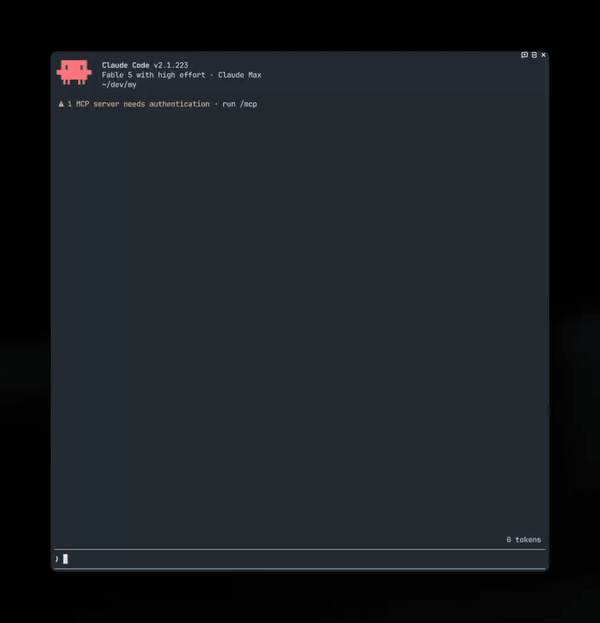

<p align="center">
  
</p>

<h1 align="center">Claude Output Style Library</h1>

<p align="center">
  <strong>same brain. eight mouths.</strong>
</p>

<p align="center">
  Make Claude talk like a human. <strong>8 installable output styles</strong> for Claude Code,<br>
  each distilled from a <strong>credited author's methodology</strong> — from Boeing-manual English<br>
  to the Minto Pyramid to the Feynman technique. One command to install and switch.
</p>

<p align="center">
  <a href="https://github.com/jase-perf/claude-output-style-library/actions/workflows/ci.yml"></a>
  <a href="#the-styles"></a>
  <a href="#how-this-library-is-built">
    </a>
  <a href="LICENSE"></a>
</p>

<p align="center">
  <a href="#before--after">See it</a> ·
  <a href="#install">Install</a> ·
  <a href="#how-this-library-is-built">How it's built</a> ·
  <a href="#the-styles">The styles</a> ·
  <a href="#make-your-own-style-maker">Make your own</a> ·
  <a href="#shared-design-rules">Design rules</a> ·
  <a href="#credit-where-this-came-from">Credit</a>
</p>

---

> [!NOTE]
> **This library began as a fork of
> [smixs/awesome-claude-output-styles](https://github.com/smixs/awesome-claude-output-styles)
> by Serge Shima, and owes it the original idea, the format guide, and the first
> draft of most styles here.** It has since diverged enough to stand on its own:
> 19 styles became 8, every one of them rewritten against a spec that did not
> exist upstream, plus a Windows installer, a bug fix in the enforce hook, four
> test suites and CI across three operating systems.
>
> Every adapted method keeps its author's name and, where one exists, their MIT
> copyright notice — all ten checked against the upstream `LICENSE` file they
> came from. See [docs/CREDITS.md](docs/CREDITS.md) and
> [Credit: where this came from](#credit-where-this-came-from).

Output styles are the right layer for fixing Claude's voice: they rewrite the
system prompt itself and reframe the agent's identity around your voice —
unlike CLAUDE.md rules, which are injected as context alongside everything
else. Every style here mirrors the exact structure of Anthropic's built-in
styles (identity line, `Style Active` marker, procedural rules), and the
optional `--enforce` hook gives them the same per-turn reminder the built-ins
get from the harness. One markdown file each, correct 2026 frontmatter,
MIT-licensed, with the original author credited in the table below.

## Why

<p align="center">
  <a href="https://gruhn.me/blog/2026-08-03/">
    
  </a>
</p>
<p align="center"><sub>Niklas Gruhn, <a href="https://gruhn.me/blog/2026-08-03/">"Don't be a meat proxy"</a> · as shared by <a href="https://x.com/joshtriedcoding/status/2084571316263256150">Josh (@joshtriedcoding)</a></sub></p>

> Jesus. I had to lookup almost every word to make sense of this.

He's not alone — the August 2026 complaint threads run hundreds of upvotes,
and the word "Claudisms" now has [its own field guide](docs/claudisms-2026.md).
The model is brilliant; the register is exhausting. Pick a voice below and fix
it in one command.

## Before / after

Real, unedited Opus 5 voice, July 2026 threads:

> The reason your React component is re-rendering is likely because you're
> creating a new object reference on each render cycle, which breaks React's
> referential equality check, so you may want to consider memoization…

The same answer, four voices:

<table>
<tr><th width="34%" align="left">Voice</th><th align="left">Same answer</th></tr>
<tr><td valign="top">

**`plain-prose`**<br><sub>the school of [Siqi Chen](https://github.com/blader/humanizer) ([@blader](https://x.com/blader)) and [Peter Yang](https://github.com/petergyang/no-ai-slop) ([@petergyang](https://x.com/petergyang))</sub>

</td><td valign="top">

> The child re-renders because its parent did, not because the prop changed —
> React re-renders children unconditionally. Wrapping the child in
> `React.memo` makes it skip when props are shallow-equal, but an inline
> object is a new reference every render, so that comparison always fails.
> `useMemo` on the object keeps the reference stable and the memo starts
> doing its job.

</td></tr>
<tr><td valign="top">

**`short-answers`**<br><sub>the compression discipline of [Julius Brussee](https://github.com/JuliusBrussee/caveman) ([@julius_brussee](https://x.com/julius_brussee)), without the grammar</sub>

</td><td valign="top">

> You need both: `React.memo` on the child and `useMemo` on the object. React
> re-renders children whenever the parent renders; `memo` opts out of that,
> and an inline object defeats `memo` by arriving as a new reference each
> time.
>
> Not checked: whether the child is already memoised. If it isn't, `useMemo`
> alone changes nothing.

</td></tr>
<tr><td valign="top">

**`small-words`**<br><sub>after [Randall Munroe](https://xkcd.com/1133/) (xkcd, *Thing Explainer*)</sub>

</td><td valign="top">

> The part that draws is told to draw again every time the part above it
> draws. You can ask it to check first and skip the work when nothing it was
> handed has changed. But you hand it a new box each time, even when the
> things inside are the same, so the check always says "this is new". Hand it
> the same box and the check starts helping.

</td></tr>
<tr><td valign="top">

**`your-turn`**<br><sub>Richard Feynman's technique — it stops before the answer</sub>

</td><td valign="top">

> Here is the part that trips almost everyone: React does not compare props to
> decide whether to re-render a child. It re-renders children whenever the
> parent renders, full stop. Comparison only happens if you opt in to it.
>
> So you added `useMemo` to the object and nothing changed. Given that, what
> do you think is still missing?

</td></tr>
</table>

```
┌──────────────────────────────────────────────────┐
│  styles                           8              │
│  credited authors & standards    20+             │
│  code touched by any persona     never           │
│  jargon left unexplained         0, by spec      │
└──────────────────────────────────────────────────┘
```

## Install

### macOS / Linux

One style (installs **and** activates it):

```bash
curl -fsSL https://raw.githubusercontent.com/jase-perf/claude-output-style-library/main/install.sh | bash -s -- plain-prose
```

Everything (installs all 8 + the style-maker skill; activate later via `/config`):

```bash
curl -fsSL https://raw.githubusercontent.com/jase-perf/claude-output-style-library/main/install.sh | bash -s -- --all
```

### Windows (PowerShell)

Windows has its own installer, [`install.ps1`](install.ps1) — same interface,
no dependencies. It uses only built-in PowerShell: no curl, no bash, no python.

One style (installs **and** activates it):

```powershell
& ([scriptblock]::Create((irm https://raw.githubusercontent.com/jase-perf/claude-output-style-library/main/install.ps1))) -Style plain-prose
```

Everything:

```powershell
& ([scriptblock]::Create((irm https://raw.githubusercontent.com/jase-perf/claude-output-style-library/main/install.ps1))) -All
```

Setting up a new machine — everything, with the reminder hook:

```powershell
& ([scriptblock]::Create((irm https://raw.githubusercontent.com/jase-perf/claude-output-style-library/main/install.ps1))) -All -Enforce
```

From a local clone it's just `.\install.ps1 -All -Enforce`.

| Parameter | Effect |
| --- | --- |
| `-Style <name> [<name>…]` | Install the named styles. A single one is also **activated**. |
| `-All` | Install all 8 plus the `style-maker` skill. Activates nothing. |
| `-Enforce` | Also install and register the per-turn reminder hook. |
| `-List` | Print the available style names. |

Requires PowerShell 5.1 (ships with Windows) or later — `pwsh` works too. The
installer **merges** into `~/.claude/settings.json` rather than overwriting it,
after backing the file up to `settings.json.bak`, so existing hooks,
permissions, and plugins survive. Re-running it is safe: the hook registers
once, not once per run.

> [!NOTE]
> The `& ([scriptblock]::Create(...))` wrapper is how a remote script receives
> arguments. Plain `irm ... | iex` runs too, but `iex` cannot forward
> parameters — it will just print usage.

<details>
<summary><b>Why not just run <code>install.sh</code> under Git Bash or WSL?</b></summary>

Because on a typical Windows box it fails twice, both times silently:

- **`bash` on PATH is usually WSL**, where `$HOME` is `/home/<user>` — not
  `C:\Users\<user>`. The installer copies the style files into the WSL filesystem,
  where Claude Code for Windows will never look, and reports success.
- **`python3` is usually a 0-byte Microsoft Store stub.** It satisfies
  `command -v python3`, so the installer takes the python branch — and then
  the call exits 9009. Activation never happens, but the script has already
  printed its progress.

`install.ps1` has neither dependency. It edits `settings.json` through
PowerShell's own JSON support, backs the file up to `settings.json.bak` first,
and merges rather than overwrites — existing hooks, permissions, and plugins
are preserved.

</details>

**After install — 3 steps.** Styles only load at session start, so nothing
changes until you **restart Claude Code**:

1. Restart Claude Code (or run `/clear`).
2. Type `/config` and find the **Output style** setting.
3. Pick the style you want from the list. Done — Claude answers in that voice
   from the next message on.

<p align="center">
  
</p>

If you installed a single style, it's already selected — you only need step 1.
Switching back: `/config` → **Output style** → `Default`.

> [!TIP]
> The old `/output-style` command was removed in Claude Code v2.1.91 — most
> guides online still mention it and are outdated. `/config` is the way.

### Make it stick: `--enforce`

A custom style is read once, at session start. Add the enforce flag to any
install command and a tiny `UserPromptSubmit` hook re-states the active style
on every turn:

> [!NOTE]
> **The evidence here conflicts, so this ships opt-in.** Claude Code's
> [output styles docs](https://code.claude.com/docs/en/output-styles) say
> "**All** output styles trigger reminders for Claude to adhere to the output
> style instructions during the conversation" — which would make this hook
> redundant. Against that: reading the shipped binary shows the reminder
> consumer looking up a **built-ins-only** table and returning nothing for a
> custom style, and no such reminder has been observed in practice.
>
> We have not run a controlled test, so we are not claiming the docs are
> wrong. **Turn this on if you notice your style fading in long
> conversations**, which is the symptom either way. It costs one short line
> per turn.

```bash
curl -fsSL https://raw.githubusercontent.com/jase-perf/claude-output-style-library/main/install.sh | bash -s -- plain-prose --enforce
```

```powershell
& ([scriptblock]::Create((irm https://raw.githubusercontent.com/jase-perf/claude-output-style-library/main/install.ps1))) -Style plain-prose -Enforce
```

macOS/Linux get [`style-reminder.sh`](hooks/style-reminder.sh); Windows gets
[`style-reminder.ps1`](hooks/style-reminder.ps1). Both behave identically.

The hook is silent for built-in styles (no double reminders) and for
`default`. Remove it anytime by deleting the entry from
`~/.claude/settings.json` → `hooks.UserPromptSubmit`.

**It follows the same settings precedence Claude Code does** —
`<project>/.claude/settings.local.json`, then `<project>/.claude/settings.json`,
then `~/.claude/settings.json` — reading the project directory from the hook's
own stdin payload. This matters because `/config` writes your output style to
the **project's** `settings.local.json`, not the user-level file. A hook that
read only `~/.claude/settings.json` would sit inside a project that had
overridden the style and cheerfully reinforce the global one every turn, which
is worse than no reminder at all.

It costs roughly 17 tokens per turn: the reminder names the active style, it
does not re-inject the style body (that already lives in the system prompt).
Every code path exits 0 — a missing, half-written, or malformed settings file
degrades to the next one down, never to a broken turn.

## The styles

### Everyday answers

| Style | What it does | Method · author |
|---|---|---|
| [`plain-prose`](output-styles/plain-prose.md) | Ordinary paragraphs, no template, no word limit. Claims are facts you can check | [Siqi Chen](https://github.com/blader/humanizer) ([@blader](https://x.com/blader)) · [Conor Bronsdon](https://github.com/conorbronsdon/avoid-ai-writing) ([@ConorBronsdon](https://x.com/ConorBronsdon)) · Joe Cotellese's generic-sentence test · **[Peter Yang](https://github.com/petergyang/no-ai-slop)** ([@petergyang](https://x.com/petergyang)) · [Hardik Pandya](https://github.com/hardikpandya/stop-slop) ([@hvpandya](https://x.com/hvpandya)) |
| [`short-answers`](output-styles/short-answers.md) | The same answer under a real word budget, closing on what it did not check | [Julius Brussee](https://github.com/JuliusBrussee/caveman) ([@julius_brussee](https://x.com/julius_brussee)) · [Carlos Duplar Mello](https://github.com/carlosduplar/caveman-output-style-claude-code) |

### Work documents

| Style | What it does | Method · author |
|---|---|---|
| [`decision-brief`](output-styles/decision-brief.md) | Answer first, ≤3 reasons, and the decision you owe named at the end | Barbara Minto's [Pyramid Principle](https://www.barbaraminto.com/) · BLUF · [Sruthi Reddy](https://github.com/sruthir28/enterprise-ai-skills) · [Joe Cotellese](https://joecotellese.com) ([@jcotellese](https://x.com/jcotellese)) |
| [`where-we-are`](output-styles/where-we-are.md) | Next action on line one, plus where the work stands, every turn | [Ayoub Ghriss](https://github.com/ayghri/i-have-adhd) · Ramsay & Rostain (*The Adult ADHD Tool Kit*) |

### Explaining to someone

| Style | What it does | Method · author |
|---|---|---|
| [`one-fact-per-sentence`](output-styles/one-fact-per-sentence.md) | ≤20-word sentences, one word one meaning, and it never drops that register | [ASD-STE100](https://www.asd-ste100.org/) (aerospace, 1983) · [Amin Boulegroun](https://github.com/AminBlg/SimpleEnglish) · **[Matt Pocock](https://github.com/mattpocock/skills)** ([@mattpocockuk](https://x.com/mattpocockuk)) |
| [`small-words`](output-styles/small-words.md) | Everyday words only, so each part is named by what it does | [Randall Munroe](https://xkcd.com/1133/) (xkcd, *Thing Explainer*) |
| [`one-analogy`](output-styles/one-analogy.md) | One comparison carries the answer, every part mapped, and where it stops being true | IEEE ProComm · Reijnierse et al. (JCOM 2025) · CMU metaphor checklist · ELI5 prompt research |
| [`your-turn`](output-styles/your-turn.md) | Ends on a question and waits, instead of handing you the answer | Richard Feynman's technique |

## Make your own: style-maker

Presets not fitting? Install the interview skill:

```bash
curl -fsSL https://raw.githubusercontent.com/jase-perf/claude-output-style-library/main/install.sh | bash -s -- style-maker
```

Then tell Claude **"make my output style"**. It asks ~10 questions (audience,
length, jargon level, tone, samples of writing you like and hate), generates
a personal style file following this repo's conventions — countable specs,
positive framing, safety guardrails — shows you a live demo, and activates it.

## Shared design rules

Every style in this hub follows the same conventions
(full authoring guide: [docs/format-guide.md](docs/format-guide.md)):

- **Specs, not adjectives.** "No sentence over 20 words" is checkable;
  "be clear" is not.
- **Positive framing.** Styles describe the voice they want, following
  Anthropic's own guidance to "tell Claude what to do instead of what not to
  do". The [Claudism list](docs/claudisms-2026.md) lives in docs for humans,
  where it is useful, rather than spending system-prompt budget inside every
  session. (This library used to justify that with "ban lists summon the
  banned patterns". That turns out to be false for frontier models —
  see [how this library is built](#how-this-library-is-built).)
- **Byte-exact guardrails.** Code, commands, error messages, file paths, and
  numbers are never stylized. Every persona shuts off for security warnings,
  destructive-action confirmations, and order-critical instructions.
- **Cut ceremony, not reasoning.** Styles shrink the wrapper, never the
  "why".
- `keep-coding-instructions: true` everywhere — the engineering stays intact.

## How this library is built

A style file is not documentation. Its body is injected verbatim into the
system prompt at session start, so every byte is a byte of system prompt in
every turn. That raises the cost of a sloppy line well above what a normal
markdown file carries, and it is why this library is built the way it is.

### Every style is machine-checked

[`tests/check-styles.sh`](tests/check-styles.sh) enforces the invariants that
used to rest on the author's discipline alone. It runs in CI on Ubuntu, macOS
and Windows, alongside three more suites covering the installers and the
enforce hook.

| The check | Why it exists |
| --- | --- |
| Guardrails carry all four carve-outs | A style whose guardrails silently dropped the destructive-action clause would install and run exactly like a correct one |
| `## Rules` has its own heading | Otherwise the guardrails section runs on, swallows the rules, and the four carve-out checks can be satisfied by rule text instead |
| Body under 3000 characters | Instruction adherence degrades as a system prompt grows; the ceiling forces the trade to be made deliberately |
| Frontmatter `name` slugifies to the filename | If they disagree, `install.sh <slug>` activates a style the user cannot then find in `/config` |
| No agent tool-call markup in the body | One style shipped with `</invoke>` as its last line and passed CI, because no structural check looks at what a line contains |
| Every style has a credit entry | Attribution cannot rot silently |

### Every style is adversarially reviewed

Styles are drafted, then reviewed by an independent agent whose brief is to
find what the author got wrong. Reviewers must build a sandbox copy of the
repo, run the suite in it, count the body themselves, and diff against the
previous version for deletions the author failed to declare — an approval
without those artifacts does not count.

Three things that process caught, none of which a passing test would have:
a verify clause changed from "at most one concept per answer" to "exactly
one", which removes permission for a short factual reply and pushes every turn
toward a mini-lecture; a safety carve-out quietly narrowed from "multi-step
instructions" to "order-critical multi-step instructions"; and a fabricated
claim about React `useMemo` that would otherwise have entered the system
prompt of every session.

### Four things here are done differently, and here's why

**1. No ban lists — but not for the reason everyone gives.**

Most style collections ship a list of forbidden words: never say "delve",
never say "it's worth noting". These styles describe the target voice instead,
following Anthropic's own guidance under *Control the format of responses* —
"**Tell Claude what to do instead of what not to do**".

The usual justification for that, which this library used to repeat, is that
banned words summon the banned words. **That is false for a model as capable
as Claude.** It has been measured once, in *Suppressing Pink Elephants with
Direct Principle Feedback* ([arXiv:2402.07896](https://arxiv.org/abs/2402.07896)),
Table 1 — rate of mentioning a forbidden topic, without → with the ban:

| Model | Without | With ban | Effect |
|---|---|---|---|
| OpenHermes-7B | 0.33 | 0.36 | backfires |
| Llama-2-13B-Chat | 0.33 | 0.25 | helps |
| GPT-4 | 0.33 | 0.13 | helps most, −61% |

The backfire is real only in the weakest model tested, and it *reverses* with
capability. So prohibitions are not purged from these styles where a
prohibition states the constraint most exactly — and every safety prohibition
stays unconditional. What changed is that the ones that remain are written the
way Anthropic writes theirs: **paired with the alternative in the same breath**,
and **given their reason**, since "Claude is smart enough to generalize from
the explanation."

The practical upshot for you: [docs/claudisms-2026.md](docs/claudisms-2026.md)
is a field guide you can read, not 900 characters of banlist spending your
session's system-prompt budget.

**2. A style changes how Claude writes, never what Claude does.**

Every style carries an explicit clause — it changes the prose, never which
tools are used, which edits are made, or when Claude stops to ask — and CI
fails the build if a style is missing it. You should not have to wonder whether
installing a terse voice also made Claude terser about warning you before it
deletes something.

**3. Eight styles, not nineteen — and the first attempt to cut them failed.**

Collections grow. Pruning one turns out to be harder than it looks, and the
first attempt here got the test wrong in a way worth describing, because the
same mistake is easy to make.

That round asked an adversary to *refute* each proposed merge by finding a
single prompt where two styles' rules produce different answers. That bar is
trivially easy to clear — five of six merges were refuted, almost nothing was
cut, and the library was still full of entries nobody could choose between.
Rules differing on paper is not the same as answers differing on screen.

The second round tested the output instead. The same four questions were
written out in all twelve styles, with the invented details held identical so
style was the only variable, and the results were compared side by side.
Twelve styles produced four or five distinguishable answers. `caveman` added
no information across four prompts — it was the same answer with the articles
removed. `smart-brevity` came in at 178 words against `decision-brief`'s 178,
same facts, same order, differing only in which label sat above the list.

A separate test showed only the names and one-line descriptions to a reader
who could not see the rules, and asked them to pick a style for eight
realistic tasks. Names that produced confident wrong picks were the ones that
got replaced. That is why nothing here is named after a person, a book, or an
acronym any more.

**4. The hardest instruction to follow gets a countable check.**

*Analysing Zero-Shot Readability-Controlled Sentence Simplification*
([arXiv:2409.20246](https://arxiv.org/abs/2409.20246), COLING 2025) found that
"all tested models struggle to simplify sentences (especially to the lowest
levels)" — the exact thing `small-words` asks
for. So those two do not trust the instruction to hold; they end with a
countable self-check on the draft's shape.

Every source above was read at the source, not through a summary of it. Claims
that reached this repo through research notes and did not survive that check
were removed rather than softened — including one this README used to make.

Everything else — the Minto Pyramid, ASD-STE100, the Feynman technique — is
**established practice, not measured effect**.
decades of use behind them and are credited to their authors in
[docs/CREDITS.md](docs/CREDITS.md). They are not evidence that this library's
implementations of them work better than the alternatives.

**What is not claimed:** no benchmark shows these styles produce measurably
better output than an unstyled Claude. The tests verify structure, the reviews
verify craft, and the citations support specific design choices. None of that
is an efficacy result, and calling it one would be the exact failure the
`plain-prose` style exists to prevent.

## The wider catalog

Original-author projects worth knowing, beyond what's adapted here:

- [mattpocock/skills](https://github.com/mattpocock/skills) — Matt Pocock
  ([@mattpocockuk](https://x.com/mattpocockuk)): `wait-what`, the four-line
  re-pitch panic button, and `writing-for-agents`, the best methodology for
  writing agent-consumed docs. Install from his repo.
- [JuliusBrussee/caveman](https://github.com/JuliusBrussee/caveman) — Julius
  Brussee ([@julius_brussee](https://x.com/julius_brussee)): the original,
  with six intensity levels, 30+ agent integrations and real benchmarks.
- [ayghri/i-have-adhd](https://github.com/ayghri/i-have-adhd) — Ayoub Ghriss:
  the top community answer to Opus 5 verbosity.
- [AminBlg/SimpleEnglish](https://github.com/AminBlg/SimpleEnglish) — Amin
  Boulegroun: ASD-STE100 enforcement with a deterministic linter.
- [blader/humanizer](https://github.com/blader/humanizer) — Siqi Chen
  ([@blader](https://x.com/blader)): the definitive AI-writing-pattern
  remover (33 patterns, self-audit loop).
- [petergyang/no-ai-slop](https://github.com/petergyang/no-ai-slop) — Peter
  Yang ([@petergyang](https://x.com/petergyang)): 20+ slop patterns with a
  voice-preservation-first stance and a self-check eval the skill runs on its
  own output.
- [hardikpandya/stop-slop](https://github.com/hardikpandya/stop-slop) —
  Hardik Pandya ([@hvpandya](https://x.com/hvpandya)): 8 rules plus a
  50-point scoring rubric.
- [conorbronsdon/avoid-ai-writing](https://github.com/conorbronsdon/avoid-ai-writing)
  — Conor Bronsdon ([@ConorBronsdon](https://x.com/ConorBronsdon)): the most
  rigorous pattern catalog (61 categories, severity tiers).
- [nattergabriel/claude-code-output-styles](https://github.com/nattergabriel/claude-code-output-styles) —
  13 well-crafted styles (Socratic, Roast, Ship It…).
- [hesreallyhim/awesome-claude-code](https://github.com/hesreallyhim/awesome-claude-code) —
  the canonical Claude Code index, with an Output Styles category.

## Sister project

[**pohuy**](https://github.com/smixs/pohuy) — the Russian profanity output
style that started this collection. Same guardrails, four roots, 18+.

## Star this repo

If one of these voices saved you a re-read, a star helps the next person find
it — and helps the credited authors get found too. ⭐

## Credit: where this came from

This library started as a fork of
[smixs/awesome-claude-output-styles](https://github.com/smixs/awesome-claude-output-styles)
by Serge Shima. The idea, the format guide, and the first draft of most styles
here are that project's work, and it is still actively worth reading.

What has changed since:

| | Upstream | Here |
| --- | --- | --- |
| Styles | 19, across 4 tiers | 8, across 3 groups — persona tier dropped, nine cut or merged |
| Style bodies | original text | all 8 rewritten against the spec below |
| Windows install | `install.sh` only | [`install.ps1`](install.ps1) |
| Windows enforce hook | — | [`style-reminder.ps1`](hooks/style-reminder.ps1) |
| Hook reads style from | `~/.claude/settings.json` | full settings precedence |
| Line endings | per-contributor `core.autocrlf` | pinned by [`.gitattributes`](.gitattributes) |
| Tests | — | 4 suites, run on 3 OSes in CI |
| MIT notices | 6 | 10, each checked against its upstream `LICENSE` |

Every method keeps its author. Where the upstream project it came from carries
an MIT copyright notice, that notice is reproduced verbatim in
[LICENSE](LICENSE) and [docs/CREDITS.md](docs/CREDITS.md), and CI fails if a
style has no credit entry.

### 0. Curated for professional use

The five persona styles — `street`, `gen-z`, `sportscaster`, `yoda`,
`bedtime-story` — are not carried here. Nothing is wrong with them; they are
simply the wrong default for a library people install at work, and a catalog
reads as serious or it doesn't. They remain available upstream, unmodified.

`short-answers` covers the terse-technical case upstream's `caveman` served,
without the dropped-articles register: compressed output is a real practice
with a real readership, and four bake-off prompts showed the grammar joke was
never the useful part.

### 1. A real Windows installer

`install.sh` needs bash and python3. On a typical Windows machine both are
*present but wrong*, and each fails without an error:

- **`bash` on PATH is normally WSL** (`C:\Windows\system32\bash.exe`), where
  `$HOME` is `/home/<user>`. The styles land in the WSL filesystem, which
  Claude Code for Windows never reads — and the script prints success.
- **`python3` is normally a 0-byte Microsoft Store stub.** It satisfies
  `command -v python3`, so the installer takes the python branch, which then
  exits 9009 — after the progress lines have already scrolled past.

[`install.ps1`](install.ps1) has no external dependencies at all.

### 2. The enforce hook follows settings precedence

Upstream's hook reads `~/.claude/settings.json` and nothing else. But `/config`
writes your output style to the **project's** `.claude/settings.local.json`, so
in any project where you picked a style, the old hook would announce the
*global* style every turn — contradicting the one actually loaded. That is
worse than no reminder.

Both hooks now resolve in the real order, taking the project directory from the
hook's own stdin payload:

```
<cwd>/.claude/settings.local.json  →  <cwd>/.claude/settings.json  →  ~/.claude/settings.json
```

[`style-reminder.sh`](hooks/style-reminder.sh) gets this too, so macOS and Linux
benefit. It also now verifies `python3` actually *runs* instead of trusting
`command -v`, and only reads stdin when not attached to a terminal, so running
it by hand cannot hang. Every code path still exits 0 — a missing, half-written,
or malformed settings file falls through to the next one rather than breaking a
turn.

### 3. Tests, and CI that runs them

Upstream has no automated checks. The invariants that make these styles safe
were held by the author's care alone — a style whose Guardrails block quietly
omitted the security clause would install and run exactly like a correct one,
and nothing would notice.

Now something does. Run the whole suite locally:

```bash
sh tests/check-styles.sh && sh tests/test-hook.sh && sh tests/test-install.sh
```

| Suite | Asserts |
| --- | --- |
| [`check-styles.sh`](tests/check-styles.sh) | Frontmatter schema · slug matches display name · identity line and `Style Active` header present · **all four Guardrails clauses present** · body within token budget · both installer lists match what's on disk · every style credited in `CREDITS.md` |
| [`test-hook.sh`](tests/test-hook.sh) · [`Test-Hook.ps1`](tests/Test-Hook.ps1) | Full precedence chain · falls through missing/empty/malformed settings · silent for built-ins · **exits 0 on every path**, because this runs on every prompt |
| [`test-install.sh`](tests/test-install.sh) | `--list` matches disk · single style activates · `--all` activates nothing · unknown style rejected · **the settings.json merge preserves existing hooks, permissions and plugins** · hook registration is idempotent |

CI runs all of it on Ubuntu, macOS and Windows, plus `shellcheck`,
PSScriptAnalyzer, and a check that no `.sh` file has acquired a CR.

Writing the tests immediately paid for itself — they caught an untestable
`Write-Host` in `-List`, a broken list parser, and the fact that `install.sh`
died with an exit-9009 Microsoft Store advert on Windows instead of falling
back to its own python-free branch.

Checks that genuinely cannot run in an environment are reported as `SKIP` with
a reason, never passed silently.

### 4. `.gitattributes`

Without it, a commit made on a Windows machine whose git has
`core.autocrlf=false` ships `install.sh` with a CR in the shebang, and every
macOS and Linux user gets `bad interpreter: /bin/sh^M`. `*.sh` is now pinned to
LF regardless of local config.

### Staying in sync

The styles themselves are untouched, so pulling upstream is clean:

```bash
git fetch upstream && git merge upstream/main
```

Only `install.sh`, the hooks, and the README carry fork changes. Note that the
install URLs here point at this fork — upstream's copies do not include the
PowerShell installer.

## Contributing

PRs welcome. One style per PR, following
[docs/format-guide.md](docs/format-guide.md): built-in prompt structure
(identity line, `Style Active` header), countable specs, positive framing,
the shared guardrails block, one positive example, a verify clause, credits
in [docs/CREDITS.md](docs/CREDITS.md) — not in the style body. If you're the
original author of a methodology we adapted and want changes — open an issue,
you outrank us.

## License

[MIT](LICENSE). Adapted styles preserve their sources' copyright notices; see
[docs/CREDITS.md](docs/CREDITS.md) and the catalog tables above.

---

<sub>
<strong>Docs:</strong> <a href="docs/format-guide.md">Format guide</a> · <a href="docs/claudisms-2026.md">Claudisms field guide</a> · <a href="skills/style-maker/SKILL.md">style-maker</a> · <a href="https://github.com/smixs/awesome-claude-output-styles/issues">Issues</a>
<br>
<strong>Also by smixs:</strong> <a href="https://github.com/smixs/pohuy">pohuy</a> — Russian profanity output style · <a href="https://github.com/smixs/visual-skills">visual-skills</a> — image prompting skills
<br><br>
MIT — the voices are free; the credit stays with their authors.
</sub>
